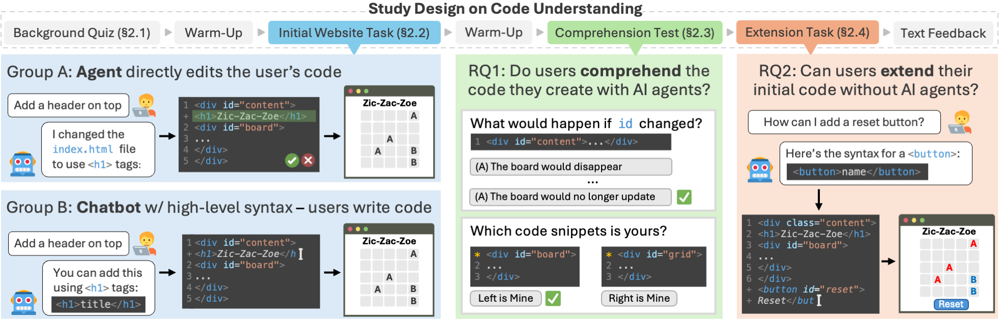

# Evaluating Code Understanding

This repository is the official implementation of the paper **(Im)Paired Programming: Coding Agents Improve Productivity but Harm Understanding**



In our study, users work with either an AI agent or chatbot to complete website development tasks. We show that agent users have improved productivity, but worse understanding.

This respository provides our collected user data, analysis scripts, and LLM judge evaluation from the study

## Table of Contents

- [Installation](#installation)
- [Quick Start](#quick-start-main-entry-points)
- [Project Structure](#project-structure)
- [Citation and Contact](#citation-and-contact)

## Installation

Our reporsitory requires Python 3.11 and can be cloned as follows:

```bash
git clone https://github.com/<your-github-username>/impaired-programming.git
cd impaired-programming
```

Requirements are in `pyproject.toml`, which we recommend installing using `uv`:

```bash
uv pip install .
```

Afterwards, copy `example.env` to `.env` and set the API keys you want to use as environment variables:
- For LLMs, we support LLM API keys from LiteLLM

## Quick Start: Main Entry Points

Below, we discuss the main entry points for our repositoriy: reproducing our analyses and running LLM judge validation

### User Data

Our data collected in the study is stored under `/data/`, organized as follows:
1. `ai_approval.json`: Dataset of user-AI review types (e.g., accept, reject) when working with agents
2. `ai_trace.json`: Dataset of user-AI prompts and responses with agents and chatbots
3. `numeric_rations.jsonl`: User responses to Likert questions
4. `prompts.xlsx`: An excel sheet of prompts that we analyze for qualitative coding
5. `qualitative_feedback.xlsx`: An excel sheet of written feedback that we analyze to guide future work
5. `user_code.json`: The main dataset of user background ability, websites, and comprehension scores

### User Study Analyses

We provide two scripts in the `/analysis/` folder:
1. `User Outcomes and Regression (Section 3).ipynb`
2. `Qualitative Analysis (Section 4).ipynb`

You can walk through each Jupyter notebook to reproduce the plots in our paper, including our hypothesis tests, regressions, and qualitative analyses


### Running LLM Judges

We provide our scripts for scoring user websites with LLMs according to our rubrics and qualitatively labeling user prompts under different clusters:

```bash
uv run python llm_judge/judge_submission.py # judge user submissions
```

```bash
uv run python llm_judge/label_prompts.py # judge user submissions
```

The top of each script has variables that can be altered to change the evaluator model and which data to run. We support any LLM in LiteLLM


## Project Structure

```
impaired-programming/
├── analysis/                          # Paper analyses (Jupyter)
│   ├── User Outcomes and Regression (Section 3).ipynb
│   └── Qualitative Analysis (Section 4).ipynb
├── data/                              # Study artifacts (JSON / JSONL)
│   ├── user_code.json                 # Final submissions, groups, timings, scores
│   ├── ai_trace.json                  # User queries and model responses
│   ├── ai_approval.json               # AI edit / approval events from the editor
│   └── numeric_ratings.jsonl          # Likert survey responses
├── llm_judge/                         # LLM rubric judging and prompt labeling
│   ├── judge_submission.py            # Rubric pass/fail per rule (LiteLLM)
│   ├── label_prompts.py               # Cluster labels for agent vs chat prompts
│   ├── prompts/                       # Task judge + clustering prompt templates
│   │   ├── judge_task1.txt
│   │   ├── judge_task2.txt
│   │   ├── label_agent_prompts.txt
│   │   └── label_chat_prompts.txt
│   └── results/                       # Script outputs (omit from git if large)
│       ├── judge_submission/
│       └── cluster/
├── images/                            # Figures for the README (optional)
├── example.env                        # Example API env vars (copy to `.env`)
├── pyproject.toml                     # Dependencies (`helpful-coding` package)
└── README.md
```

## Citation and Contact

If you find our paper or data useful, we would appreciate it if you cite our paper!

```bibtex
Coming soon!
```

For questions or issues, please open an issue on the repository or contact me via email!
